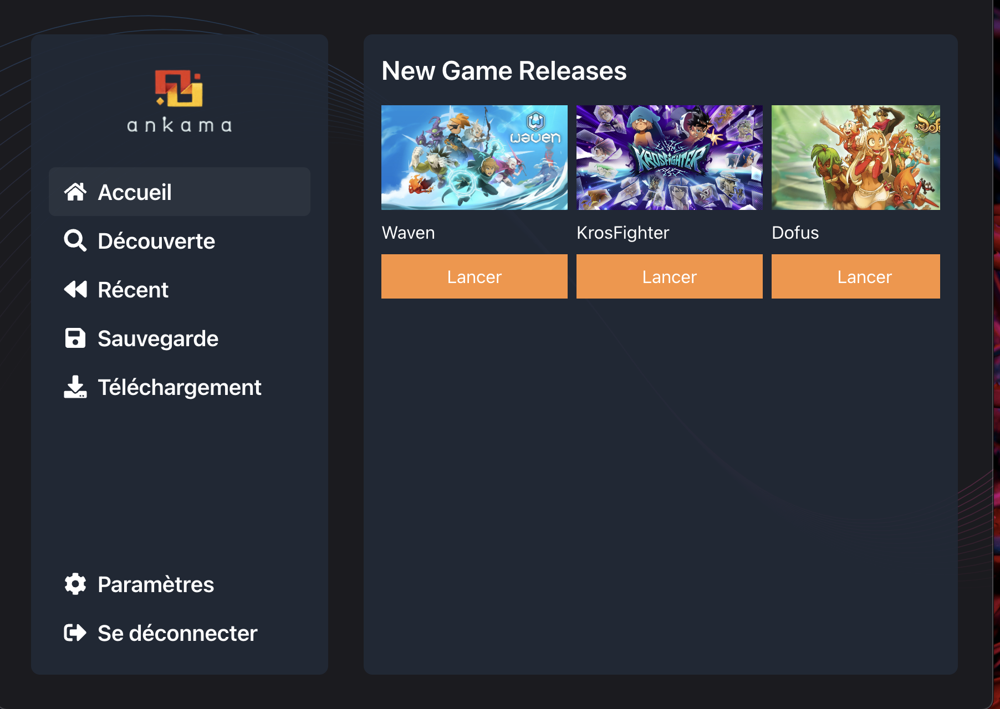

# ankama-launcher

An Electron application with Vue and TypeScript


- [static folder] static files using nginx (want to used for this project but not used)
- [database folder] postgres database
  -  please use this data using studio  
  

This project is just a sample to quickly test my skills in vue3 sfc electron and vite tech stack
The graphical chart/style are quickly improvised too :)

# Screenshot



## Recommended IDE Setup

- [VSCode](https://code.visualstudio.com/) + [ESLint](https://marketplace.visualstudio.com/items?itemName=dbaeumer.vscode-eslint) + [Prettier](https://marketplace.visualstudio.com/items?itemName=esbenp.prettier-vscode) + [Volar](https://marketplace.visualstudio.com/items?itemName=Vue.volar) + [TypeScript Vue Plugin (Volar)](https://marketplace.visualstudio.com/items?itemName=Vue.vscode-typescript-vue-plugin)

## Project Setup

### Install

```bash
$ npm install
```

### Development

```bash
$ npm run dev:back
$ npm run dev
```

### Build

```bash
# For windows
$ npm run build:win

# For macOS
$ npm run build:mac

# For Linux
$ npm run build:linux
```
